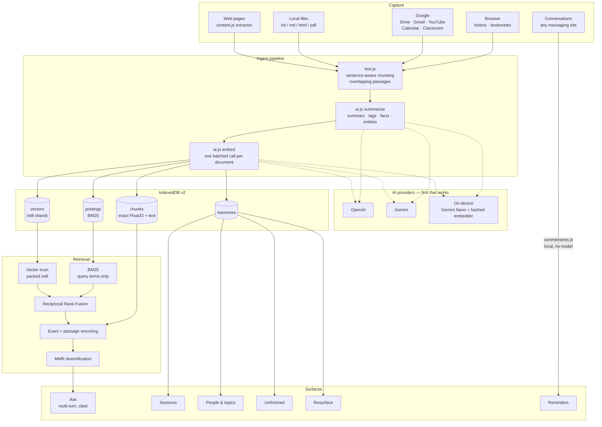

# mem — your second memory

> Not a search bar over your history. A memory that answers, notices, and reminds.

mem is a Chrome extension that captures what you read, watch, write, and are told,
then lets you ask questions across all of it — with the passage that actually
answered you, cited. It runs entirely on your machine. You can use your own API
key, or no key at all.

**→ [TRY_IT.md](TRY_IT.md) — try it in 3 minutes, no account and no API key.**

## Why this isn't your browser history

Chrome history can already tell you which URLs you visited and when. Everything
below is something it structurally cannot do:

| | history | mem |
| --- | --- | --- |
| Find a page by its title | ✅ | ✅ |
| Find something by what it *said*, not what it was called | ✗ | ✅ |
| Answer a question from a paragraph on page 12 of a PDF | ✗ | ✅ |
| Ask a follow-up and have it understood | ✗ | ✅ |
| Group Tuesday afternoon into "the session where I was debugging auth" | ✗ | ✅ |
| Show everything about one person across email, calendar and docs | ✗ | ✅ |
| Tell you what you started and never finished | ✗ | ✅ |
| Bring back something you're about to forget | ✗ | ✅ |
| Notice a deadline in a chat and offer to remind you | ✗ | ✅ |

## What it does

**Ask anything.** Type a question, get a written answer with `[#N]` citations
that scroll to the source. Follow-ups work — "why?" is resolved against the
conversation into a standalone query before retrieval, so the second question
finds its own sources instead of reusing the first one's.

**Sessions.** Your activity, reconstructed into the stretches of work it
actually belonged to. Split on idle gaps and on changes of subject, named from
their own contents. "That thing I was doing Tuesday" becomes a real object.

**People & topics.** A graph linking every person, organisation and concept
across email, calendar, documents, videos and pages. One page per person shows
everything mem has ever seen about them. Names resolve conservatively — "Jamie"
folds into "Jamie Chen" only when exactly one person matches, because a wrong
merge silently attributes one person's mail to another.

**Unfinished.** Assignments not turned in, messages that asked something and
never got an answer, long pages you got 18% through and left. This needs state,
which is why a history search can't do it.

**Resurface.** A forgetting curve over your own memories, weighted by how much
you seemed to care at the time. Plus connections: two things you saw months
apart that belong together — exactly the pair you'd never think to search for,
because you no longer remember the older one exists.

**Reminders from conversations.** On sites you opt in to, mem watches messages
for a time plus an obligation ("the report is due Friday at 3pm") and offers to
set a reminder. Works on any messaging platform. Detection is pure local string
matching — no model call, and nothing leaves the machine unless you accept.
Anywhere else, select text and use **Remind me about this…** from the
right-click menu.

**Capture from everywhere.** Web pages, local files, Google Drive, Gmail,
YouTube, Calendar, Classroom, bookmarks, and six months of browser history.

## Install

**[Get mem on the Chrome Web Store](https://chromewebstore.google.com/detail/mepjgndefdedophcmeeanmbbjhoedigo)** — one click, then pin the mem icon and open the dashboard (`Ctrl+Shift+M`).

Or run it from source:

1. Open `chrome://extensions`, toggle **Developer mode**.
2. **Load unpacked** → pick the `extension/` folder.
3. Pin the mem icon, open the dashboard (`Ctrl+Shift+M`), and choose how it thinks.

### Choosing how it thinks

| | cost | quality |
| --- | --- | --- |
| **On-device** | free, no key, no network | Good summaries and answers via Chrome's built-in Gemini Nano. Semantic search matches on shared vocabulary rather than a learned model — weaker than a cloud embedding, but works offline. |
| **Gemini** | free tier | Best value. `gemini-2.5-flash` + `gemini-embedding-001`. |
| **OpenAI** | ~$0.001/page | `gpt-4o-mini` + `text-embedding-3-small`. |

On-device needs Chrome 138+ on desktop and a one-time ~2GB model download.
Whichever you pick, mem falls back to on-device automatically when your key is
missing, rate-limited, or you're offline — so it never simply stops working.

## How retrieval works

The part that matters most is chunking. A 60,000-character page used to get one
embedding computed over its title plus the first 2,000 characters, so a fact
halfway down was unreachable by meaning no matter how you phrased the question.
The test harness measures this directly: for a fact buried at character 13,650,
document-level similarity to the question is **0.054** — indistinguishable from
noise — while the chunk containing it scores **0.237**, about 4× higher, and
end-to-end retrieval returns that passage as the evidence.

The full pipeline:

1. **Candidates**, two independent ways — an approximate semantic scan over an
   int8-quantised packed matrix, and BM25 over an inverted index that only
   touches the query's own terms.
2. **Fusion** by Reciprocal Rank Fusion. RRF reads rank position only, which is
   what lets an unbounded BM25 score and a bounded cosine score vote in the same
   election. (The previous `0.7 × cosine + 0.3 × lexical` blend was adding two
   quantities with no shared unit.)
3. **Rescoring** of the survivors against exact Float32 vectors, including every
   passage of the document rather than just its opening.
4. **Diversification** by MMR, so six near-identical history rows for one article
   can't occupy every slot handed to the model.
5. **Answer** written from the matched passages, with citations.

Cost per query: one embedding call, a few postings reads, one chunk read per
surviving candidate. The corpus is never loaded.

## Architecture



**Reading the diagram:** capture is many-to-one — everything becomes text and
flows through the same chunk → summarize → embed pipeline. The provider row is
a fallback *chain*, not a choice made once: a call tries the configured cloud
provider and drops to on-device if the key is missing, rate-limited, or the
machine is offline. Retrieval is the two-stage funnel described above. Chat is
the one path that bypasses the pipeline entirely — commitment detection is pure
local string matching, so message text is never embedded, stored, or sent.

```
extension/
├── manifest.json          Manifest V3, module service worker
├── background.js          save pipeline, scans, alarms, message router
├── ambient.js             content script: engagement, related memories, commitments
├── content.js             page content extractor
├── popup / dashboard / options
├── test/harness.html      100 tests, no network, no API key
└── lib/
    ├── vec.js             Float32/int8 vector math, RRF, MMR
    ├── text.js            tokenising and sentence-aware chunking
    ├── index.js           ordinal table, packed vector shards, BM25 postings
    ├── storage.js         IndexedDB v2 + migration from v1
    ├── search.js          two-stage hybrid retrieval
    ├── ai.js              OpenAI / Gemini / on-device, with fallback chain
    ├── local.js           Chrome built-in AI + local hashed embeddings
    ├── ingest.js          shared pipeline: chunk → embed → index
    ├── conversation.js    multi-turn threads and query rewriting
    ├── deepen.js          background upgrade of title-only memories
    ├── episodes.js        activity → named sessions
    ├── entities.js        the people/topics graph
    ├── openloops.js       unfinished detection
    ├── resurface.js       forgetting curve and connections
    ├── commitments.js     local time + obligation detection
    ├── reminders.js       scheduling, alarms, notifications
    └── drive/gmail/youtube/calendar/classroom/history/bookmarks/files
```

### Storage

Schema v2 splits what was one fat record into stores with different access
patterns: displayable memories, int8 vector shards, per-document passage text
and exact vectors, BM25 postings, and the episode and entity graphs. Existing
v1 databases migrate in place with **no API calls** — the embeddings already on
disk are lifted into the index rather than recomputed.

Vectors are quantised to int8 against a per-vector scale. At 1536 dimensions a
unit vector's typical component is about 0.025, so a fixed scale would use
roughly seven of 255 available levels; the per-vector scale is measured at
**14× more accurate** for the same storage.

## Testing

```bash
python mem/tools/serve.py 3492 mem/extension
```

Then open `http://localhost:3492/test/harness.html`. 129 tests covering vector
maths, chunk coverage, index persistence across reloads, v1→v2 migration,
buried-fact retrieval, MMR de-duplication, embedding-space isolation, episode
segmentation, entity alias resolution, open loops, the forgetting curve, and
commitment detection — with no network and no API key. The on-device model is
stubbed and embeddings use the real local hashed embedder, so every number is
deterministic.

Served from localhost the harness has its own origin, so its IndexedDB is a
different database from the installed extension's. Running it cannot touch your
real memories.

## Privacy

- Memories live in your browser via IndexedDB. There is no backend.
- Your API key lives in `chrome.storage.local` and is sent only to the provider
  you chose. On-device mode sends nothing anywhere.
- Reminder-watching is off everywhere by default and enabled per site. Detection
  runs locally; only a reminder you explicitly accept is stored.
- Engagement tracking is two numbers per page — how long, how far — stored
  locally. It's what makes "you never finished this" possible instead of guessed.
- Other extensions must be approved individually in Settings before they can
  read or write your memories.

## Citations & prior art

The retrieval design is assembled from established techniques rather than
invented. Where mem departs from them, the code says why.

- **BM25** — Robertson & Zaragoza, *The Probabilistic Relevance Framework:
  BM25 and Beyond* (2009). Standard `k1 = 1.2`, `b = 0.75`. Implemented in
  `lib/index.js`.
- **Reciprocal Rank Fusion** — Cormack, Clarke & Büttcher, *Reciprocal Rank
  Fusion Outperforms Condorcet and Individual Rank Learning Methods* (SIGIR
  2009). The `K = 60` constant is theirs. `lib/vec.js`.
- **Maximal Marginal Relevance** — Carbonell & Goldstein, *The Use of MMR,
  Diversity-Based Reranking for Reordering Documents* (SIGIR 1998).
  `lib/vec.js`.
- **Scalar quantisation with approximate-then-exact rescoring** — the standard
  shape used by FAISS and modern vector databases. `lib/vec.js`, `lib/index.js`.
- **Feature hashing with a signed hash** — Weinberger et al., *Feature Hashing
  for Large Scale Multitask Learning* (ICML 2009). This is what makes the
  on-device embedder work without a learned model. `lib/local.js`.
- **Contextual chunk headers** — prefixing each passage with its document title
  before embedding, so a mid-document chunk doesn't lose its subject. Common
  practice in RAG systems. `lib/ingest.js`.
- **Conversational query rewriting** — resolving a follow-up into a standalone
  query *before* retrieval, per the conversational-search literature (e.g.
  Elgohary et al., *Can You Unpack That?*, EMNLP 2019). `lib/conversation.js`.
- **The forgetting curve** — Ebbinghaus (1885), with stability modulated by
  encoding signals as in modern spaced-repetition schedulers (SM-2, FSRS).
  `lib/resurface.js`.

APIs and platform features used: Chrome Extensions Manifest V3
(`chrome.alarms`, `chrome.notifications`, `chrome.history`, `chrome.bookmarks`,
`chrome.identity`, `chrome.scripting`), the Chrome built-in AI Prompt and
Summarizer APIs, IndexedDB, the OpenAI and Google Gemini REST APIs, and the
Google Drive, Gmail, YouTube Data, Calendar and Classroom REST APIs.

No code was copied from these sources; they are the references the
implementations were written against.

## Roadmap

- ✅ Chunked retrieval, hybrid ranking, multi-turn conversation
- ✅ On-device AI with automatic fallback
- ✅ Sessions, entity graph, open loops, resurfacing, connections
- ✅ Commitment detection and reminders
- Next: `.docx` and better PDF handling, screenshot OCR, weekly digests
- Eventually: optional end-to-end-encrypted sync for cross-device memory

> "What was that thing I saw about solar cells breaking down?"

That moment is the hook. Everything else exists to make the answer worth reading.
